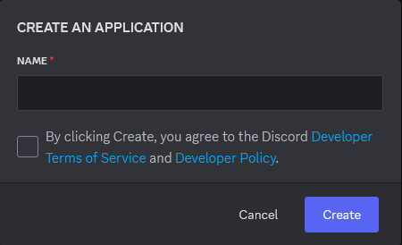
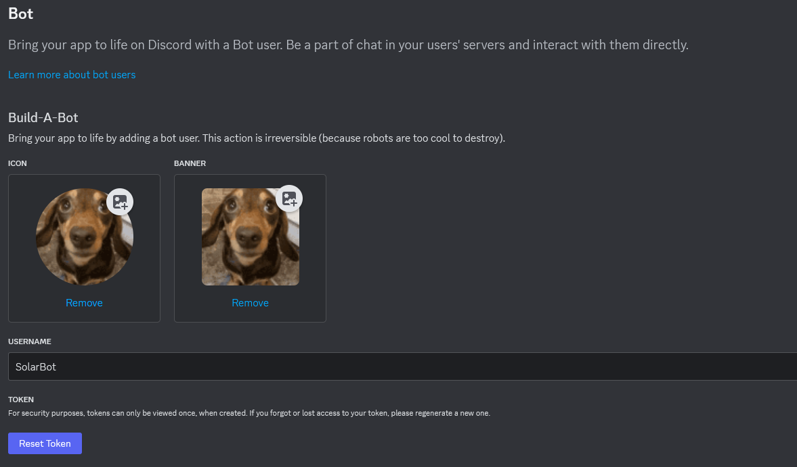
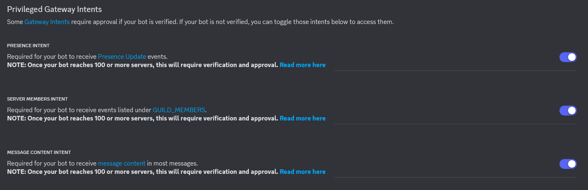
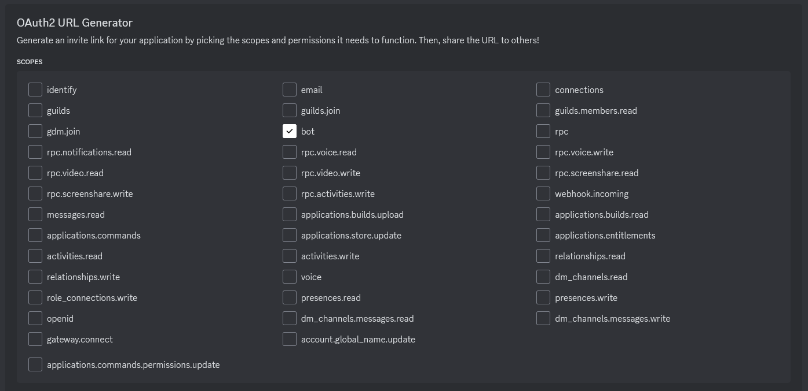
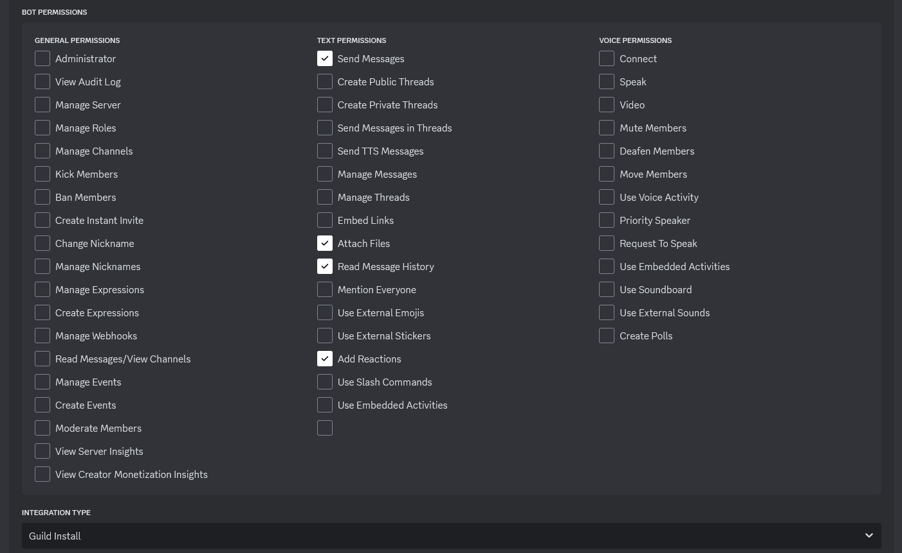
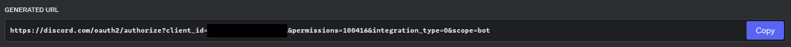

# Discord Bot

## Index
*  [Description](#Description)
*  [Current Features](#Current-Features)
*  [Setup](#Setup)
*  [Useful Links](#Useful-Links)

## Description
 This is the code for a simple discord bot that I am making for fun and to learn.
 Feel free to use the code for your own bot or to learn from it.
 The bot is written in python and mainly uses the py-cord library which is a fork of discord.py among a few other libraries.
 The bot is still a work in progress and is changing frequently as I add new features and fix bugs.

## Current Features
*   A banking system with a simple economy that uses a sqlite database to store user balances
*   Some basic commands such as ping, greetings, and a custom help command
*   Blackjack which uses the economy system to bet and win/lose money
*   A fishing minigame that allows users to catch unique fish and sell them for money
*   A few simple admin commands to clear messages, kick, ban, and unban users (if you and the bot have the correct permissions).
*   Some more complex admin commands such as enabling message logging or blacklisting channels so that the bot cant speak in them (message logging only works for messages sent AFTER the bot has started running).
*   And a few other fun commands such as a magic 8-ball and a coin flip
*   This is not an exhaustive list so feel free to look around!

## Setup
*  Create new application in discord developer portal

*  Select the bot section and create a new token 
   *  Keep the token secret, do not share it with anyone
  

*  Below the token you should also select all the intents

*  Now Select the OAuth2 Section to set up the bot invite link
   *  Select the bot scope

*  Select the permissions
   * Only select permissions that you want the bot to have at the very least it should be allowed to send and read messages and the admin commands will need specific permissions such as manage messages

* Copy the link and paste it in your browser to invite the bot to your server

*  Now you can clone the repository and create a .env file in the root directory
   *  Add the following to the .env file replacing the {YOUR_TOKEN} with the token you copied earlier
   *  DISCORD_TOKEN={YOUR_TOKEN}

*  All you need to do now is install the required packages and run the bot
   *  If you have the discord pip package installed you will need to uninstall it as it conflicts with py-cord, discord.py is fine though
*  Run the following command in the terminal
    *  `pip install -r requirements.txt`
  *  Run the bot
     *  `python main.py`

## Useful Links
*  [Discord Developer Portal](https://discord.com/developers/applications)
*  [Discord.py Documentation](https://discordpy.readthedocs.io/en/stable/)
*  [Py-cord Documentation](https://guide.pycord.dev/introduction)
